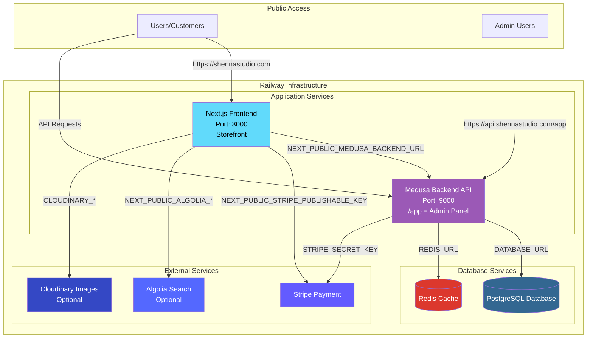

# Railway Production Environment Variables for Shenna's Studio

## Overview

This document provides a complete guide to setting up environment variables for Shenna's Studio on Railway.app. It includes all required and optional variables for each service, along with an architecture diagram.

---

## Railway Architecture Diagram



---

## Service 1: PostgreSQL Database

**Service Type:** Railway PostgreSQL  
**Auto-generated Variables:** ✅ (Railway creates these automatically)

### Environment Variables (Auto-Generated by Railway)

```bash
# These are automatically created by Railway when you add PostgreSQL
POSTGRES_USER=postgres
POSTGRES_PASSWORD=<auto-generated-password>
POSTGRES_DB=railway
DATABASE_URL=postgresql://${{POSTGRES_USER}}:${{POSTGRES_PASSWORD}}@${{RAILWAY_PRIVATE_DOMAIN}}:5432/${{POSTGRES_DB}}
DATABASE_PUBLIC_URL=postgresql://${{POSTGRES_USER}}:${{POSTGRES_PASSWORD}}@${{RAILWAY_TCP_PROXY_DOMAIN}}:${{RAILWAY_TCP_PROXY_PORT}}/${{POSTGRES_DB}}
PGHOST=${{RAILWAY_PRIVATE_DOMAIN}}
PGPORT=5432
PGUSER=${{POSTGRES_USER}}
PGPASSWORD=${{POSTGRES_PASSWORD}}
PGDATABASE=${{POSTGRES_DB}}
```

**✅ No manual configuration needed** - Railway automatically provides these.

---

## Service 2: Redis Cache

**Service Type:** Railway Redis  
**Auto-generated Variables:** ✅ (Railway creates these automatically)

### Environment Variables (Auto-Generated by Railway)

```bash
# These are automatically created by Railway when you add Redis
REDIS_URL=redis://default:${{REDIS_PASSWORD}}@${{RAILWAY_PRIVATE_DOMAIN}}:6379
REDIS_PUBLIC_URL=redis://default:${{REDIS_PASSWORD}}@${{RAILWAY_TCP_PROXY_DOMAIN}}:${{RAILWAY_TCP_PROXY_PORT}}
REDIS_PASSWORD=<auto-generated-password>
REDISHOST=${{RAILWAY_PRIVATE_DOMAIN}}
REDISPORT=6379
REDISUSER=default
```

**✅ No manual configuration needed** - Railway automatically provides these.

---

## Service 3: Medusa Backend API

**Service Type:** Node.js Application  
**Repository:** Your GitHub repo (ocean-backend directory)  
**Build Command:** `cd ocean-backend && npm install && npm run build`  
**Start Command:** `cd ocean-backend && npm start`  
**Port:** 9000

### Required Environment Variables

```bash
# ==============================================
# DATABASE CONNECTION (Reference PostgreSQL service)
# ==============================================
DATABASE_URL=${{PostgreSQL.DATABASE_URL}}
DATABASE_SSL=true
DATABASE_SSL_REJECT_UNAUTHORIZED=false

# ==============================================
# REDIS CONNECTION (Reference Redis service)
# ==============================================
REDIS_URL=${{Redis.REDIS_URL}}

# ==============================================
# SECURITY SECRETS (Generate these!)
# ==============================================
# Generate with: openssl rand -hex 32
JWT_SECRET=<generate-64-character-hex-string>
COOKIE_SECRET=<generate-64-character-hex-string>

# ==============================================
# CORS CONFIGURATION (Production Domains)
# ==============================================
STORE_CORS=https://shennastudio.com,https://www.shennastudio.com
ADMIN_CORS=https://api.shennastudio.com,https://admin.shennastudio.com
AUTH_CORS=https://shennastudio.com,https://www.shennastudio.com,https://api.shennastudio.com

# ==============================================
# ADMIN USER CREDENTIALS (First-time setup)
# ==============================================
ADMIN_EMAIL=admin@shennastudio.com
ADMIN_PASSWORD=<create-strong-password>

# ==============================================
# AUTO-INITIALIZATION (First deployment only)
# ==============================================
AUTO_MIGRATE=true
AUTO_SEED=false
AUTO_CREATE_ADMIN=true

# ==============================================
# MEDUSA CONFIGURATION
# ==============================================
MEDUSA_ADMIN_ONBOARDING_TYPE=default
MEDUSA_ADMIN_ONBOARDING_NEXTJS=true
BACKEND_URL=https://api.shennastudio.com
MEDUSA_BACKEND_URL=https://api.shennastudio.com

# ==============================================
# SERVER CONFIGURATION
# ==============================================
NODE_ENV=production
PORT=9000
WORKER_MODE=shared

# ==============================================
# STRIPE PAYMENT (Required)
# ==============================================
# Get from: https://dashboard.stripe.com/apikeys
STRIPE_API_KEY=sk_live_<your-stripe-secret-key>
STRIPE_SECRET_KEY=sk_live_<your-stripe-secret-key>

# ==============================================
# OPTIONAL: Database Logging
# ==============================================
DATABASE_LOGGING=false
```

### Optional Environment Variables

```bash
# ==============================================
# OPTIONAL: ALGOLIA SEARCH
# ==============================================
ALGOLIA_APPLICATION_ID=<your-algolia-app-id>
ALGOLIA_ADMIN_API_KEY=<your-algolia-admin-key>

# ==============================================
# OPTIONAL: CLOUDINARY IMAGE STORAGE
# ==============================================
CLOUDINARY_CLOUD_NAME=<your-cloudinary-name>
CLOUDINARY_API_KEY=<your-cloudinary-api-key>
CLOUDINARY_API_SECRET=<your-cloudinary-api-secret>
```

---

## Service 4: Next.js Frontend

**Service Type:** Node.js Application  
**Repository:** Your GitHub repo (root directory)  
**Build Command:** `npm install && npm run build`  
**Start Command:** `npm start`  
**Port:** 3000

### Required Environment Variables

```bash
# ==============================================
# BACKEND API CONNECTION (Reference Backend service)
# ==============================================
NEXT_PUBLIC_MEDUSA_BACKEND_URL=https://api.shennastudio.com
# OR use Railway reference:
# NEXT_PUBLIC_MEDUSA_BACKEND_URL=${{Backend.RAILWAY_PUBLIC_DOMAIN}}

# ==============================================
# MEDUSA PUBLISHABLE KEY (Get from Admin Panel after backend is running)
# ==============================================
# 1. Deploy backend first
# 2. Login to admin panel at https://api.shennastudio.com/app
# 3. Go to Settings > Publishable API Keys
# 4. Copy the key and add it here
NEXT_PUBLIC_MEDUSA_PUBLISHABLE_KEY=pk_<get-from-medusa-admin-panel>

# ==============================================
# STRIPE PAYMENT (Required)
# ==============================================
# Get from: https://dashboard.stripe.com/apikeys
STRIPE_SECRET_KEY=sk_live_<your-stripe-secret-key>
NEXT_PUBLIC_STRIPE_PUBLISHABLE_KEY=pk_live_<your-stripe-publishable-key>

# ==============================================
# NEXTAUTH CONFIGURATION
# ==============================================
# Generate with: openssl rand -base64 32
NEXTAUTH_SECRET=<generate-44-character-base64-string>
NEXTAUTH_URL=https://shennastudio.com

# ==============================================
# SERVER CONFIGURATION
# ==============================================
NODE_ENV=production
NEXT_TELEMETRY_DISABLED=1
HOSTNAME=0.0.0.0
PORT=3000
```

### Optional Environment Variables

```bash
# ==============================================
# OPTIONAL: ALGOLIA SEARCH
# ==============================================
NEXT_PUBLIC_ALGOLIA_APPLICATION_ID=<your-algolia-app-id>
NEXT_PUBLIC_ALGOLIA_SEARCH_API_KEY=<your-algolia-search-key>
ALGOLIA_ADMIN_API_KEY=<your-algolia-admin-key>

# ==============================================
# OPTIONAL: CLOUDINARY IMAGE OPTIMIZATION
# ==============================================
NEXT_PUBLIC_CLOUDINARY_CLOUD_NAME=<your-cloudinary-name>
CLOUDINARY_CLOUD_NAME=<your-cloudinary-name>
CLOUDINARY_API_KEY=<your-cloudinary-api-key>
CLOUDINARY_API_SECRET=<your-cloudinary-api-secret>

# ==============================================
# OPTIONAL: DATABASE (If using Prisma in frontend)
# ==============================================
DATABASE_URL=${{PostgreSQL.DATABASE_URL}}
```

---

## Quick Setup Checklist

### Step 1: Create Railway Project
- [ ] Create new Railway project
- [ ] Add PostgreSQL service (auto-configures)
- [ ] Add Redis service (auto-configures)

### Step 2: Generate Secrets
```bash
# Generate JWT_SECRET (64 chars)
openssl rand -hex 32

# Generate COOKIE_SECRET (64 chars)
openssl rand -hex 32

# Generate NEXTAUTH_SECRET (44 chars)
openssl rand -base64 32

# Generate ADMIN_PASSWORD
openssl rand -base64 24
```

### Step 3: Get External API Keys
- [ ] Stripe keys from https://dashboard.stripe.com/apikeys
- [ ] (Optional) Algolia keys from https://www.algolia.com/account/api-keys
- [ ] (Optional) Cloudinary keys from https://cloudinary.com/console

### Step 4: Deploy Backend Service
- [ ] Create new service in Railway
- [ ] Connect your GitHub repository
- [ ] Set root directory to `ocean-backend`
- [ ] Add all Backend environment variables listed above
- [ ] Deploy and wait for completion

### Step 5: Get Medusa Publishable Key
- [ ] Access admin panel: https://api.shennastudio.com/app
- [ ] Login with ADMIN_EMAIL and ADMIN_PASSWORD
- [ ] Navigate to: Settings > Publishable API Keys
- [ ] Copy the publishable key (starts with `pk_`)

### Step 6: Deploy Frontend Service
- [ ] Create new service in Railway
- [ ] Connect your GitHub repository
- [ ] Set root directory to root (or leave empty)
- [ ] Add all Frontend environment variables listed above
- [ ] Add the Medusa Publishable Key from Step 5
- [ ] Deploy and wait for completion

### Step 7: Configure Custom Domains
- [ ] Backend: api.shennastudio.com → Backend Service
- [ ] Frontend: shennastudio.com → Frontend Service
- [ ] Frontend: www.shennastudio.com → Frontend Service

---

## Environment Variable Reference Guide

### Railway Service References

When services are in the same Railway project, you can reference their environment variables:

```bash
# Reference PostgreSQL service
${{PostgreSQL.DATABASE_URL}}

# Reference Redis service
${{Redis.REDIS_URL}}

# Reference Backend service
${{Backend.RAILWAY_PUBLIC_DOMAIN}}
```

### Variable Priority (Highest to Lowest)

1. **Service-specific environment variables** (set in Railway UI)
2. **Shared variables** (set at project level)
3. **Railway-generated variables** (automatic)
4. **Default values in code** (fallback)

### Required vs Optional Variables

**❗ REQUIRED (Application won't work without these):**
- `DATABASE_URL`
- `REDIS_URL`
- `JWT_SECRET`
- `COOKIE_SECRET`
- `STORE_CORS`, `ADMIN_CORS`, `AUTH_CORS`
- `NEXT_PUBLIC_MEDUSA_BACKEND_URL`
- `STRIPE_SECRET_KEY`
- `NEXT_PUBLIC_STRIPE_PUBLISHABLE_KEY`
- `NEXTAUTH_SECRET`

**✨ OPTIONAL (Enhanced functionality):**
- Algolia variables (search functionality)
- Cloudinary variables (image optimization)
- Database logging
- Auto-initialization flags

---

## Security Best Practices

### 1. Secret Generation
```bash
# Always generate cryptographically secure secrets
openssl rand -hex 32    # For JWT_SECRET, COOKIE_SECRET
openssl rand -base64 32 # For NEXTAUTH_SECRET
```

### 2. Never Commit Secrets
- ❌ Don't add secrets to `.env` files in git
- ✅ Use Railway's environment variable UI
- ✅ Use `.env.example` files with placeholder values

### 3. Use Production Keys
- ❌ Don't use Stripe test keys (`sk_test_`, `pk_test_`) in production
- ✅ Use Stripe live keys (`sk_live_`, `pk_live_`)
- ✅ Set `NODE_ENV=production`

### 4. CORS Configuration
- ❌ Don't use `*` or `http://localhost` in production CORS
- ✅ Use specific production domains only
- ✅ Include www and non-www versions if needed

### 5. Database Security
- ✅ Enable SSL for database connections (`DATABASE_SSL=true`)
- ✅ Use private Railway domains for internal communication
- ✅ Use public URLs only when connecting from outside Railway

---

## Troubleshooting

### Backend Won't Start
**Check:**
1. `DATABASE_URL` is correctly set and references PostgreSQL service
2. `REDIS_URL` is correctly set and references Redis service
3. `JWT_SECRET` and `COOKIE_SECRET` are at least 32 characters
4. PostgreSQL and Redis services are running

### Frontend Can't Connect to Backend
**Check:**
1. `NEXT_PUBLIC_MEDUSA_BACKEND_URL` matches your backend domain
2. Backend CORS includes your frontend domain in `STORE_CORS`
3. Backend is deployed and running
4. Custom domain is properly configured

### Admin Panel Won't Load
**Check:**
1. Backend is accessible at `https://api.shennastudio.com`
2. Admin panel is at `https://api.shennastudio.com/app`
3. `ADMIN_CORS` includes the admin domain
4. Backend build completed successfully

### Payment Not Working
**Check:**
1. Using production Stripe keys (not test keys)
2. `STRIPE_SECRET_KEY` set in backend
3. `NEXT_PUBLIC_STRIPE_PUBLISHABLE_KEY` set in frontend
4. Both keys are from the same Stripe account
5. Stripe webhook configured (if using)

---

## Post-Deployment Tasks

### 1. Change Admin Password
- Login to admin panel
- Go to Settings > My Account
- Change password immediately

### 2. Create Publishable API Key
- Login to admin panel
- Go to Settings > Publishable API Keys
- Create new key or copy existing
- Add to frontend environment variables

### 3. Configure Stripe Webhooks (if needed)
- Go to Stripe Dashboard > Webhooks
- Add endpoint: `https://api.shennastudio.com/hooks/stripe`
- Add webhook secret to backend: `STRIPE_WEBHOOK_SECRET`

### 4. Disable Auto-Initialization
After first successful deployment:
```bash
AUTO_MIGRATE=false
AUTO_SEED=false
AUTO_CREATE_ADMIN=false
```

### 5. Setup Monitoring
- Enable Railway's built-in monitoring
- Configure log retention
- Set up health check endpoints

---

## Example: Complete Railway Setup

### Service: Backend (Medusa API)

```bash
# Railway Service Settings
Name: shenna-backend
Root Directory: ocean-backend
Build Command: npm install && npm run build
Start Command: npm start
Port: 9000

# Environment Variables
DATABASE_URL=${{PostgreSQL.DATABASE_URL}}
REDIS_URL=${{Redis.REDIS_URL}}
JWT_SECRET=a1b2c3d4e5f6789012345678901234567890abcdef1234567890abcdef123456
COOKIE_SECRET=z9y8x7w6v5u4t3s2r1q0p9o8n7m6l5k4j3i2h1g0f9e8d7c6b5a4z3y2x1w0v9u8
STORE_CORS=https://shennastudio.com,https://www.shennastudio.com
ADMIN_CORS=https://api.shennastudio.com
AUTH_CORS=https://shennastudio.com,https://api.shennastudio.com
ADMIN_EMAIL=admin@shennastudio.com
ADMIN_PASSWORD=SuperSecurePassword123!
STRIPE_API_KEY=sk_live_51ABC...xyz
NODE_ENV=production
PORT=9000
```

### Service: Frontend (Next.js)

```bash
# Railway Service Settings
Name: shenna-frontend
Root Directory: (leave empty or /)
Build Command: npm install && npm run build
Start Command: npm start
Port: 3000

# Environment Variables
NEXT_PUBLIC_MEDUSA_BACKEND_URL=https://api.shennastudio.com
NEXT_PUBLIC_MEDUSA_PUBLISHABLE_KEY=pk_abc123def456ghi789
STRIPE_SECRET_KEY=sk_live_51ABC...xyz
NEXT_PUBLIC_STRIPE_PUBLISHABLE_KEY=pk_live_51ABC...xyz
NEXTAUTH_SECRET=Kx9Mq2Pz5Rw8Ty6Uh3Vj0Bn4Cm7Dl1Em5Fn9Gp2Hq6
NEXTAUTH_URL=https://shennastudio.com
NODE_ENV=production
PORT=3000
```

---

## Summary

✅ **PostgreSQL** - Auto-configured by Railway  
✅ **Redis** - Auto-configured by Railway  
✅ **Backend** - 15+ required variables, 5+ optional  
✅ **Frontend** - 8+ required variables, 8+ optional  

**Total Setup Time:** ~30 minutes (including domain configuration)

**Resources:**
- Railway Docs: https://docs.railway.app
- Medusa Docs: https://docs.medusajs.com
- Stripe Docs: https://stripe.com/docs/api

---

**Last Updated:** January 2025  
**Compatible With:** Medusa v2.10.1, Next.js 15.5.3